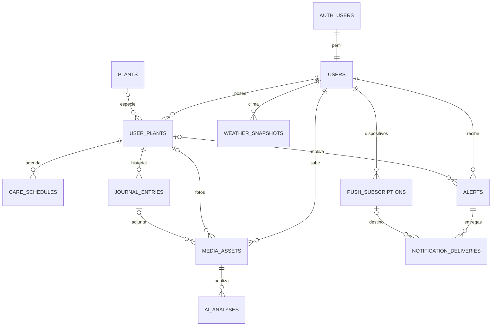

# PlantCare — Fase 1: planificación y arquitectura

## Alcance y decisiones

Esta fase entrega el diseño y la migración inicial. La inicialización de Next.js, instalación de dependencias, conexión a servicios y autenticación de la aplicación corresponden a la Fase 2, pendiente de aprobación.

Arquitectura: monolito modular TypeScript con Next.js App Router, React, Tailwind CSS y validación Zod. Supabase aporta PostgreSQL, Auth y Storage privado. Migraciones SQL versionadas y tipos generados desde PostgreSQL evitan mantener un segundo modelo independiente. El acceso de usuario usa su sesión y RLS; las claves de servicio sólo se utilizan en procesos del servidor autorizados.

Pl@ntNet identifica especies; Gemini analiza imágenes para hipótesis de diagnóstico. Ambos se encapsularán detrás de adaptadores del servidor. El identificador/modelo se fija en configuración al integrar y se almacena por análisis. Las fichas de cuidados provienen de un catálogo revisado con fuente y fecha: identificar una especie no equivale a obtener cuidados fiables. Los resultados generados no modifican automáticamente el catálogo global.

OpenWeatherMap aporta clima actual por coordenadas; sus datos se cachean y caducan. No asumimos acceso a pronósticos ni alertas oficiales mediante el endpoint actual. Web Push con VAPID y un adaptador de correo transaccional cubrirán avisos. Supabase Cron activará un worker con una cola persistida en PostgreSQL. Next.js se desplegará en un entorno Node compatible, inicialmente Vercel, y Supabase gestionará los datos; la contratación y el despliegue quedan para fases posteriores.

## Estructura prevista

```text
PlantCare/
  docs/FASE_1.md
  supabase/
    migrations/202609250001_initial_schema.sql
    tests/phase1.sql
  src/
    app/
      (auth)/login/page.tsx
      (auth)/register/page.tsx
      (dashboard)/plants/page.tsx
      (dashboard)/plants/[id]/page.tsx
      (dashboard)/calendar/page.tsx
      (dashboard)/calculator/page.tsx
      (dashboard)/settings/page.tsx
      api/ai/identify/route.ts
      api/ai/diagnose/route.ts
      api/jobs/notifications/route.ts
      manifest.ts
    components/ui/
    features/{auth,plants,journal,ai,care,notifications}/
    lib/supabase/{client,server,admin}.ts
    lib/providers/{plantnet,gemini,weather,email}.ts
    lib/validation/
    types/database.ts
  public/sw.js
  tests/{unit,integration,e2e}/
```

Sólo docs y supabase se crean en esta fase. Los directorios restantes indican dónde se implementará cada módulo.

## Modelo de datos

`auth.users` guarda identidad, correo y credenciales administradas por Supabase. `public.users` es el perfil de negocio, asociado 1:1. No duplicamos contraseñas ni el correo como fuente de autenticación.



Todas las entidades privadas contienen `user_id`; el diagrama omite algunas flechas de propiedad para facilitar la lectura. Las claves foráneas compuestas impiden asociar un diario, análisis o alerta con recursos de otro usuario, incluso si el escritor tiene acceso administrativo.

| Tabla | Responsabilidad |
|---|---|
| users | Nombre, ubicación opcional, zona IANA y preferencias de avisos |
| plants | Especies globales, cuidados base y procedencia de información |
| user_plants | Ejemplares, ubicación interior/exterior, maceta y ajustes particulares |
| care_schedules | Frecuencia base/efectiva, próximo cuidado y explicación del cálculo |
| journal_entries | Eventos fechados, notas, riegos y mediciones |
| media_assets | Metadatos y rutas privadas; fotos previas a la identificación permitidas |
| ai_analyses | Proveedor, modelo, estado, resultado versionado y confianza opcional |
| weather_snapshots | Observaciones climáticas con ubicación y vencimiento |
| alerts | Avisos visibles, lectura y deduplicación lógica |
| push_subscriptions | Una suscripción por navegador/dispositivo |
| notification_deliveries | Entregas por canal/dispositivo, reintentos y bloqueo temporal |

El código completo está en `supabase/migrations/202609250001_initial_schema.sql`. Usa UUID, timestamptz, restricciones, índices, RLS, creación automática de perfiles y políticas de Storage. Se ejecuta una sola vez en Supabase, dentro de una transacción; no está diseñado para PostgreSQL sin los esquemas de Supabase.

## Contratos para las fases siguientes

- Autenticación: registro con verificación de correo, login, logout, recuperación y sesión SSR. Cada mutación valida sesión, payload y propiedad. Operaciones con service_role verifican explícitamente el usuario antes de acceder a recursos.
- Catálogo: una especie puede tener varios ejemplares. `plant_id` nulo permite agregar una planta desconocida. Archivar es la acción habitual; borrar definitivamente elimina los registros dependientes.
- Archivos: bucket privado; URLs firmadas temporales. Validar bytes, formato, tamaño y decodificación, y quitar EXIF antes de enviar imágenes a IA. Storage y SQL no comparten transacción: subir, persistir metadatos y compensar fallos. Un proceso conciliará objetos huérfanos, incluidas fotos de registros borrados. No eliminar objetos manipulando directamente storage.objects.
- IA: validar respuestas con un schema Zod versionado, registrar proveedor/modelo, limitar consumo por usuario y aplicar timeout. Mostrar alternativas y permitir confirmar/corregir especie. El diagnóstico presenta hipótesis y acciones prudentes; la confianza declarada por un modelo no se presenta como probabilidad clínica calibrada. Errores del proveedor no generan fichas inventadas.
- Riego: función pura con especie, maceta, sustrato, exposición, último evento, clima vigente y estación según hemisferio. Sin coordenadas/clima vigente se usa la frecuencia base y se explica el fallback. No inferir clima interior o humedad real del sustrato a partir del clima exterior. Recomendar comprobar humedad antes de regar. La fórmula y sus límites se validarán en Fase 5.
- Agenda: completar un cuidado registra el evento y actualiza la agenda en una sola transacción/RPC idempotente. Recalcular no significa que la planta fue regada. Registrar versión y factores en calculation_context. Se admiten ajustes manuales.
- Calculadora: volumen a partir de dimensiones interiores y geometría elegida; receta estructurada con componentes cuya suma sea 100 %. Los porcentajes, geometría y límites se validan en el dominio. No requiere tabla de resultados salvo que el usuario decida guardar uno en la ficha o diario.
- Avisos: insertar alerta y entregas en transacción. Deduplicar por evento/vencimiento y dispositivo. Worker con claim atómico, lease, recuperación de trabajos abandonados, reintentos limitados y backoff. Consultar consentimiento antes de enviar; eliminar suscripciones inválidas. El envío externo puede completarse antes de confirmar en BD: usar idempotencia del proveedor cuando exista; no prometer exactamente una entrega.
- PWA: manifest, iconos, HTTPS y service worker. Primera entrega offline: carcasa y pantalla sin conexión; no cachear sesiones, APIs privadas o fotos sensibles. IA, subida y escrituras requieren conexión. La compatibilidad de Push se detecta por navegador y se ofrece correo según preferencias.

Los campos JSONB contienen estructuras variables, no relaciones. Se validan como objetos en SQL; las claves y versiones concretas se cerrarán con Zod al implementar cada módulo. Las columnas administrativas de análisis, catálogo global, clima y envíos no son editables por el usuario. Las preferencias y la agenda personal sí lo son.

## Fases y criterios de salida

1. Arquitectura: revisar stack, ERD y permisos; ejecutar migración y prueba de aislamiento en desarrollo.
2. Configuración/Auth: compilación, registro, verificación, login/logout, sesión y dashboard protegido.
3. CRUD/Diario: dos cuentas aisladas; alta/edición/archivo, fotos privadas y cronología correcta.
4. IA: imágenes válidas/inválidas, respuestas ambiguas, errores/cuotas y confirmación de especie.
5. Riego/Calculadora: hemisferios, zonas horarias, clima ausente/vencido, interior/exterior y conversiones de volumen.
6. Alertas/PWA: instalación, modo sin conexión, permisos, deduplicación y reintentos en navegadores objetivo.

Cada fase se detiene para aprobación antes de iniciar la siguiente. Las versiones exactas se fijarán con lockfile al inicializar; no se instalan paquetes en esta fase.

## Cómo comprobar esta fase

1. Leer el ERD y comprobar que una especie compartida puede representar varios ejemplares y que una planta desconocida no exige IA.
2. En un proyecto Supabase **de desarrollo nuevo**, abrir SQL Editor y ejecutar el contenido completo de la migración como postgres. Requiere los roles, Auth y Storage de Supabase. Si aparece un error, detenerse y conservar el mensaje; la transacción evita un esquema parcial.
3. Ejecutar `supabase/tests/phase1.sql` como postgres en el mismo editor. El script cambia al rol authenticated y simula dos identidades para verificar acceso real por RLS. El resultado esperado es `PASS: aislamiento, integridad, permisos y bucket privado`. Los usuarios y datos sintéticos desaparecen con ROLLBACK.
4. Revisar Table Editor: deben existir 11 tablas públicas nuevas. Revisar Storage: plant-images debe ser privado, con límite de 10 MiB y JPEG/PNG/WebP permitidos.
5. En Fase 2 generar tipos desde esta base; en Fase 3 agregar pruebas HTTP de Storage con dos sesiones reales. El SQL de esta fase comprueba configuración del bucket, no la subida por HTTP.

No se ejecutó contra una base real en esta entrega: el entorno no tiene psql ni Docker disponibles y no se ha conectado un proyecto Supabase. El esquema requiere pasar estas pruebas antes de considerarse validado para producción.

## Referencias oficiales

- Next.js App Router: https://nextjs.org/docs/app/getting-started/installation
- Supabase PostgreSQL: https://supabase.com/docs/guides/database/overview
- RLS: https://supabase.com/docs/guides/database/postgres/row-level-security
- Perfiles de Auth: https://supabase.com/docs/guides/auth/managing-user-data
- Pl@ntNet: https://my.plantnet.org/doc/api/identify
- Gemini imágenes: https://ai.google.dev/gemini-api/docs/image-understanding
- OpenWeatherMap actual: https://openweathermap.org/current
- Supabase Cron: https://supabase.com/docs/guides/cron
- PWA: https://nextjs.org/docs/app/guides/progressive-web-apps
